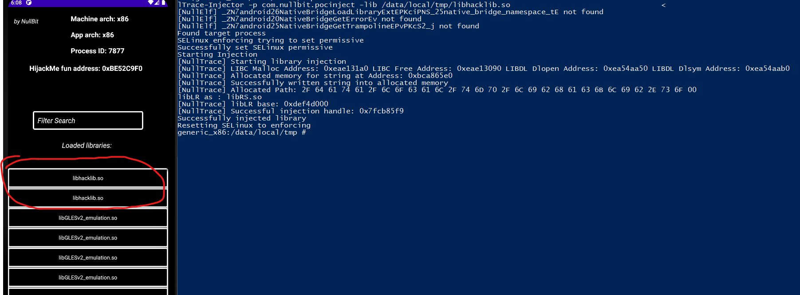

# NullTrace-Android-Injector
# Inject shared libraries on any process in android

Successful shared library injections tested on real devices and emulators (handles nativebridge for arm lib injections on emulator)

#Building:

1: Make a new environment variable called NDK and link the root NDK directory to it
Or manually adjust the NDK and CMake_Toolchain paths here: 
[Link NDK](https://github.com/0NullBit0/NullTrace-Android-Inject/blob/main/CMakeLists.txt#L<7>)
[Link CMAKE_TC](https://github.com/0NullBit0/NullTrace-Android-Inject/blob/main/CMakeLists.txt#L<8>)

2: On Windows: run the build.bat file in powershell by: ```.\build.bat```

On Unix: run the build.sh file by:
```./build.sh``` or ```bash build.sh``` or ```sh build.sh```

3: The executables will be inside ```build_out/{arch}/NullTrace-Injector```


Running: 
```
su
chmod 777 NullInject
chmod 777 (libraryname).so
./NullTrace-Injector -p (packagename) -lib (library path)
```
flags:
```
-p flag : provide package name like com.nullbit.pocinject
-lib flag : provide full library path like /data/local/tmp/libhacklib.so
```



# Emulator injection showcase:
# https://www.youtube.com/watch?v=Og3SngzD6TI

