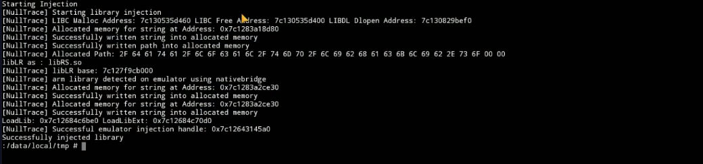

# NullTrace-Android-Injector
Inject shared libraries on any process in android

SUCCESSFULL EMULATOR INJECTIONS tested on bluestacks android 9 and 11 + nativebridge injection supported now in the new update (Arm lib injection on emulator)!

Building:
have ndk-build as env variable be in root dir and do
```
ndk-build
```


Running: 
```
su
chmod 777 NullInject
./NullInject -p (packagename) -lib (library path)

```
flags:
```
-p flag : provide package name like com.nullbit.pocinject
-lib flag : provide full library path like /data/local/tmp/libhacklib.so
```


# Emulator inject showcase:
# [Video]https://www.youtube.com/watch?v=Og3SngzD6TI

